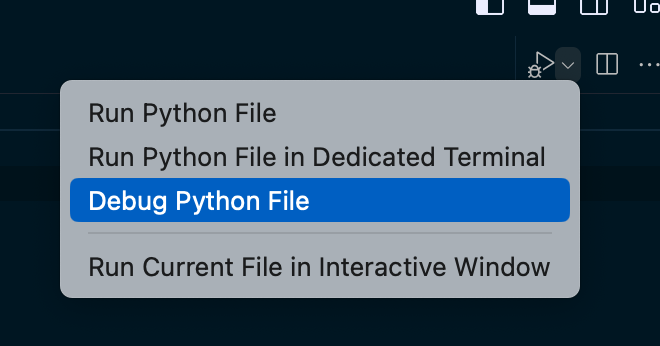
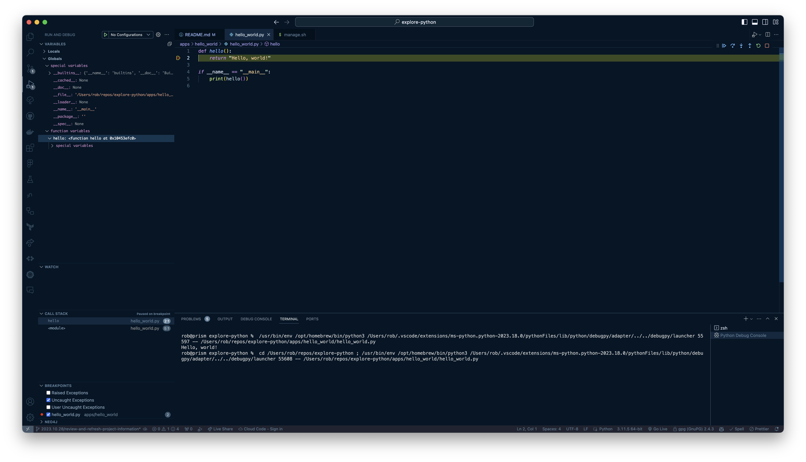

# Welcome

This project will explore getting started developing with [Python](https://www.python.org) as quickly as possible using [Visual Studio Code](https://code.visualstudio.com).

## Local development

If you are using Python for development, the `manage.sh` script provides several utility commands to streamline common tasks:

- `./manage.sh setup` - **Set up the environment and start the application:** This command prepares the development environment by creating a virtual environment in the `.venv` directory (if it doesn't exist). If a `requirements.txt` file is present in the specified app directory (default is `apps/hello_world`), the dependencies listed will be installed. After setting up the environment, the application script (default is `hello_world.py`) is executed.
- `./manage.sh start` - **Start the application:** This command ensures that the virtual environment is set up, activates it, and then runs the specified application script. After execution, the virtual environment is deactivated.
- `./manage.sh test` - **Run tests:** This command ensures that the virtual environment is set up and then runs the tests using pytest. If you want to test with coverage, use the `--coverage` flag.
- `./manage.sh test --coverage` - **Run tests with coverage:** This command runs all tests and generates a coverage report. The report is generated in the `htmlcov` directory, and the index page of the report is automatically opened in your default browser.
- `./manage.sh destroy` - **Clean up the environment:** This command removes the `.venv` virtual environment, effectively deleting all the installed packages and configurations. It's useful when you want to reset your development environment.

Note: You can customize the app directory and script by setting the `APP_DIR` and `APP_SCRIPT` environment variables, respectively. For instance:

```sh
APP_DIR="myappdir" APP_SCRIPT="myscript.py" ./manage.sh
```

This would use `myappdir` as the app directory and `myscript.py` as the application script.

For developers with `npm` installed, there are several helper scripts in the `package.json` file:

- "setup": "clear && ./manage.sh setup",
- "start": "clear && ./manage.sh start",
- "test": "clear && ./manage.sh test",
- "test:coverage": "clear && ./manage.sh test --coverage",
- "destroy": "clear && ./manage.sh destroy"


### EXAMPLE: Hello, world!
What project starter would be complete without an obligatory "Hello, world!" example? 🤓

```sh
(.venv) hello-world % python3 hello_world.py 
Hello, world!
```

This project also includes having an ability to debug code using VS Code - and example unit tests to get you started:





## Python cheat sheet
If you're just getting started with Python, here are snippets of commands that you may find helpful to get you up and running in no time.

```sh
# Verify that you have Python installed on your machine
% python3 --version
Python 3.11.1

# Create a new virtual environment for the project
% python3 -m venv .venv

# Select your new environment by using the Python: Select Interpreter command in VS Code
#   - Enter the path: ./.venv/bin/python

# Activate your virtual environment
% source .venv/bin/activate
(.venv) %

# PREFERRED: Install the packages from requirements.txt
(.venv) % pip install -r requirements.txt

# Install Python packages in a virtual environment
# (.venv) % pip install <package_name>

# Install Python testing packages
# (.venv) % pip install pytest pytest-asyncio
# (.venv) % pip install pytest-cov

# When you are ready to generate a requirements.txt file
# (.venv) % pip freeze > requirements.txt

# Uninstall the package from your virtual environment
# (.venv) % pip uninstall simplejson

# Remove the dependency from requirements.txt if it exists
# (.venv) % pip uninstall -r requirements.txt

# To run unit tests:
# (.venv) % pytest

# To run unit tests and automatically view the HTML coverage report on macOS:
# (.venv) % pytest --cov=. --cov-report=html && open htmlcov/index.html

# To run a single unit test
# (.venv) % pytest test_something.py

# Deactivate your virtual environment
(.venv) % deactivate
% 

```
